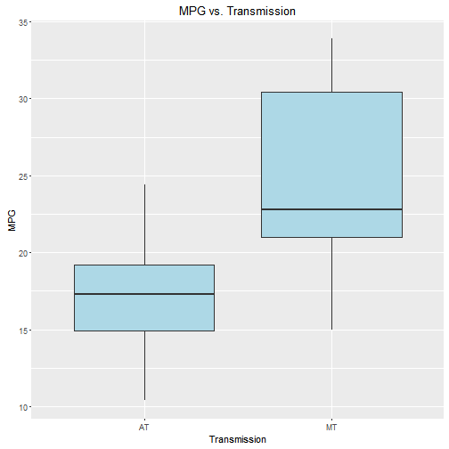
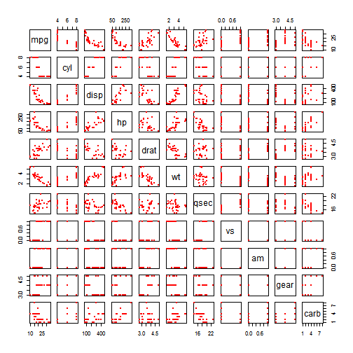
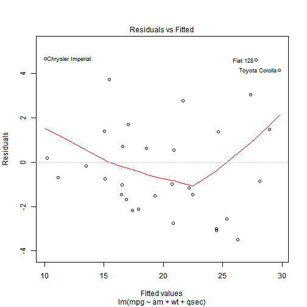
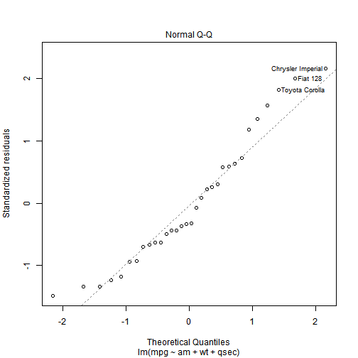

# __Insight of Motor Trend: How Transmission Type Affect MPG__

##### __Guang Yang__

##### __November 25, 2016__

## Synopsis

Home-owned vihicles are very common nowadays; people who are in the market may always look at the MPG index, which stands for economy and ecology. On the other hand, cars with auto transmission (AT) are much easier to handle, comparing with manual transmission (MT). This case study analyses the impact of AT/MT on MPG --- if MT is better for MPG, or vice versa, and the quantitative difference in MPG by MT/AT.

* The Analysis section holds scripts and text for analytical path of the questions addressed.

* The Executive Summary section concludes the results from Analysis.

* Some additional exploratory data analysis are included in the Appendix section.


## Analysis

### Regression of Single Variable (`am`)


```r
data(mtcars)
fit1 <- lm(mpg ~ am, data = mtcars)
summary(fit1)$coef
```

```
##              Estimate Std. Error   t value     Pr(>|t|)
## (Intercept) 17.147368   1.124603 15.247492 1.133983e-15
## am           7.244939   1.764422  4.106127 2.850207e-04
```

```r
pval <- summary(fit1)$coef[1,4]
ci <- round(confint(fit1)[2,], 4)
ci
```

```
##   2.5 %  97.5 % 
##  3.6415 10.8484
```

```r
mpg_diff <- round(summary(fit1)$coef[2,1], 4)
```

As seen above, the p-value of the slope (1.1339835 &times; 10<sup>-15</sup>) is less than 0.05, and the confidence interval (3.6415, 10.8484) is entirely above 0. Hence the transmission does have an impact on the MPG, despite other parameters of a car.

### Multi-Variable Regression

To select the adjusting variables from the entire vector set, we firstly look at the trend between all pairs of vectors (`Correlations between Variables` in __Appendix__ section). In order not to include too many correlated variables, we choose the variables 1) correlate with `mpg` and 2) NOT positively correlate with other variables. By common sense `wt` is chosen, and the rest is `qsec`. (`cyl` was consiered but didn't pass the nexted model test.)


```r
fit2 <- lm(mpg ~ am + wt, data = mtcars)
fit3 <- lm(mpg ~ am + wt + qsec, data = mtcars)
fit4 <- lm(mpg ~ am + wt + qsec + cyl, data = mtcars)
anova(fit1, fit2, fit3, fit4)
```

```
## Analysis of Variance Table
## 
## Model 1: mpg ~ am
## Model 2: mpg ~ am + wt
## Model 3: mpg ~ am + wt + qsec
## Model 4: mpg ~ am + wt + qsec + cyl
##   Res.Df    RSS Df Sum of Sq       F    Pr(>F)    
## 1     30 720.90                                   
## 2     29 278.32  1    442.58 71.2196 4.734e-09 ***
## 3     28 169.29  1    109.03 17.5458 0.0002681 ***
## 4     27 167.78  1      1.50  0.2416 0.6270601    
## ---
## Signif. codes:  0 '***' 0.001 '**' 0.01 '*' 0.05 '.' 0.1 ' ' 1
```

```r
pvalcyl <- anova(fit1, fit2, fit3, fit4)[4,6]
```

Note all p-values, except the 4th value (0.6270601), are smaller than 0.05; hence the multi-variable model is not redundant.


```r
summary(fit3)$coef
```

```
##              Estimate Std. Error   t value     Pr(>|t|)
## (Intercept)  9.617781  6.9595930  1.381946 1.779152e-01
## am           2.935837  1.4109045  2.080819 4.671551e-02
## wt          -3.916504  0.7112016 -5.506882 6.952711e-06
## qsec         1.225886  0.2886696  4.246676 2.161737e-04
```

```r
ci3 <- round(confint(fit3)[2,], 4)
mpg_diff3 <- round(summary(fit3)$coef[2,1], 4)
```

As the confidence interval of slope of `am` (0.0457, 5.8259) is exclusively above 0, it's also considered significant.


## Executive Summary

The analysis section shows the inferential analysis of the impact on MPG (`mpg`), both by the single vector of transmission (`am`), and by multi-variable modelling including transmission (`am`), weight (`wt`) and 1/4 mile time (`qsec`).

From the result of the analysis section, it's concluded, from both single and multiple vector modelling, that MPG is influenced by transmission type; more specifically, the MPG is improved (increased) by MT. The difference in MPG is 7.2449 mile/gallon from single-variable model, and 2.9358 mile/gallon from multi-variable model.


## Appendix

### Histogram of MPG and Transmission


```r
library(ggplot2)
g1 <- ggplot(mtcars, aes(x = ifelse(am == 0, 'AT', 'MT'), y = mpg))
g1 + geom_boxplot(fill = 'lightblue') +
        labs(title = 'MPG vs. Transmission', x = 'Transmission', y = 'MPG')
```



### Correlations between Variables


```r
pairs(mtcars, pch = 19, cex = 0.5, col = 'red')
```



### Residual Plots


```r
plot(fit3, which = 1)
```



```r
plot(fit3, which = 4)
```


The residual is slightly patterned in a 'V' shape, with couple vehicle models run a bit off of the regression curve. However, the Cook's distance indicates that these points are not necessarily treated as outliers.


```r
plot(fit3, which = 2)
```



```r
library(car)
levene <- leveneTest(mpg ~ factor(am), data = mtcars)
levene
```

```
## Levene's Test for Homogeneity of Variance (center = median)
##       Df F value  Pr(>F)  
## group  1  4.1876 0.04957 *
##       30                  
## ---
## Signif. codes:  0 '***' 0.001 '**' 0.01 '*' 0.05 '.' 0.1 ' ' 1
```

```r
pvalresid <- round(levene[1,3], 4)
```
The QQ plot shows that the residuals are approximately normally distributed. The simple Levene's Test gives p-value of 0.0496, which is smaller than 0.05, indicating approximately normal distribution of the residuals.
