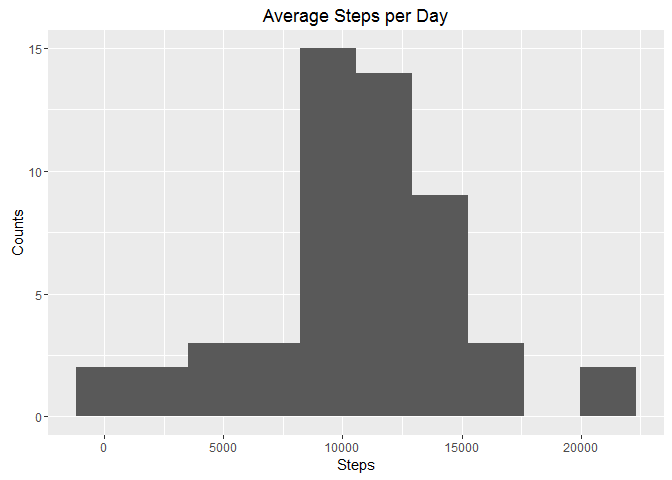
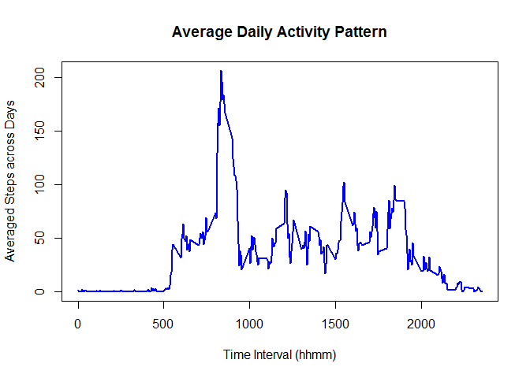
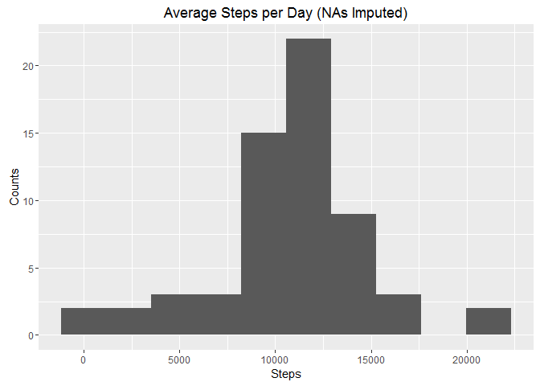
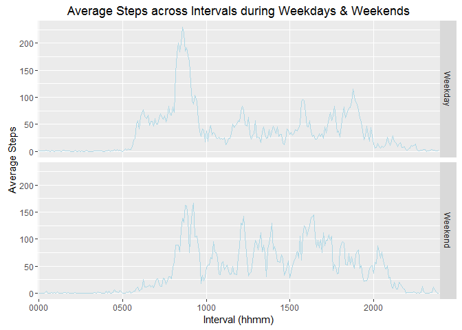

# Reproducible Research: Peer Assessment 1


# Reproducible Research: Peer Assessment 1

## output: Week2_ProgrammingAssignment.rmd

##  html_document:


## Loading and preprocessing the data

```r
# Make sure it's the working folder where 'RepData_PeerAssessment1-master.zip' file exists.
Url <- 'https://d396qusza40orc.cloudfront.net/repdata%2Fdata%2Factivity.zip'
if(!file.exists('activity.zip')) {download.file(Url, destfile = 'activity.zip')}
unzip('activity.zip')
dat <- read.csv('activity.csv', stringsAsFactors = FALSE)

# Formatting date and time; note time is not ready to read.
library(lubridate)
```

```
## 
## Attaching package: 'lubridate'
```

```
## The following object is masked from 'package:base':
## 
##     date
```

```r
dat$interval <- as.character(dat$interval)
dat$interval <- sapply(seq_along(dat$date), function(i) {
        len <- nchar(dat$interval[i])
        pre <- paste(replicate(4 - len, '0'), collapse = '')
        paste0(pre, dat$interval[i], '00')
})
dat$DateTime <- strptime(paste0(dat$date, ',', dat$interval), '%Y-%m-%d,%H%M%S')
dat$date <- as.Date(dat$date)
dat$interval <- substr(dat$interval, 1, 4)
```

## What is mean total number of steps taken per day?

```r
library(ggplot2)
aggrd <- aggregate(steps ~ date, dat, sum, na.rm = TRUE)
ggplot(aggrd, aes(steps)) + geom_histogram(bins = 10) +
        labs(x = 'Steps', y = 'Counts', title = 'Average Steps per Day')
```

<!-- -->

```r
rmean <- mean(aggrd$steps)
rmedian <- median(aggrd$steps)
```

The average steps of each day is 1.0766189\times 10^{4}.
The median steps of each day is 10765.


## What is the average daily activity pattern?


```r
aggri <- aggregate(steps ~ interval, dat, mean, na.rm = TRUE)
plot(aggri$interval, aggri$steps, type = 'l', col = 'blue', lwd = 2,
     xlab = 'Time Interval (hhmm)', ylab = 'Averaged Steps across Days',
     main = 'Average Daily Activity Pattern')
```

<!-- -->

```r
rmaxi <- aggri$interval[which.max(aggri$steps)]
rmaxi <- paste0(substr(rmaxi, 1, 2), ':', substr(rmaxi, 3, 4))
rmaxf <- aggri$interval[which.max(aggri$steps) + 1]
rmaxf <- paste0(substr(rmaxf, 1, 2), ':', substr(rmaxf, 3, 4))
```

On average, the maximum steps occur between 08:35 and 08:40.


## Imputing missing values


```r
rNA <- mean(is.na(dat$steps))
dat$stepsNNA <- dat$steps
dat$stepsNNA <- sapply(seq_along(dat$steps), function(i) {
        if(is.na(dat$steps[i])) {
                dat$stepsNNA[i] <- aggri$steps[aggri$interval == dat$interval[i]]
        }
        dat$stepsNNA[i]
})
aggrdNNA <- aggregate(stepsNNA ~ date, dat, sum, na.rm = TRUE)
ggplot(aggrdNNA, aes(stepsNNA)) + geom_histogram(bins = 10) +
        labs(x = 'Steps', y = 'Counts', title = 'Average Steps per Day (NAs Imputed)')
```

<!-- -->

```r
rmeanNNA <- mean(aggrdNNA$stepsNNA)
rmedianNNA <- median(aggrdNNA$stepsNNA)
```

There are 0.1311475 rows of NAs - these values are replaced with the average steps of corresponding intervals across days.
As a result, the mean now is 1.0766189\times 10^{4}, and median is 1.0766189\times 10^{4}.


## Are there differences in activity patterns between weekdays and weekends?


```r
library(plyr)
```

```
## 
## Attaching package: 'plyr'
```

```
## The following object is masked from 'package:lubridate':
## 
##     here
```

```r
dat <- mutate(dat, weekdays = ifelse(
        weekdays(dat$date) %in% c('Saturday', 'Sunday'),
        'Weekend', 'Weekday'
))
dat$weekdays <- as.factor(dat$weekdays)
aggrw <- aggregate(stepsNNA ~ interval + weekdays, dat, mean)
ggplot(aggrw, aes(x = interval, y = stepsNNA, group = weekdays)) +
        facet_grid(weekdays ~ .) + geom_line(color = 'lightblue') +
        labs(x = 'Interval (hhmm)', y = 'Average Steps',
             title = 'Average Steps across Intervals during Weekdays & Weekends') +
        scale_x_discrete(breaks = c('0000', '0500', '1000', '1500', '2000'))
```

<!-- -->
