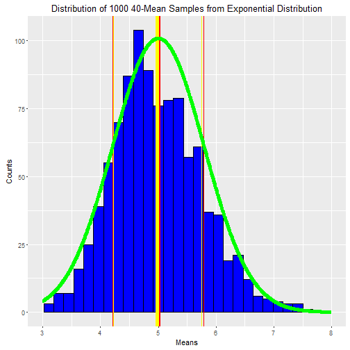
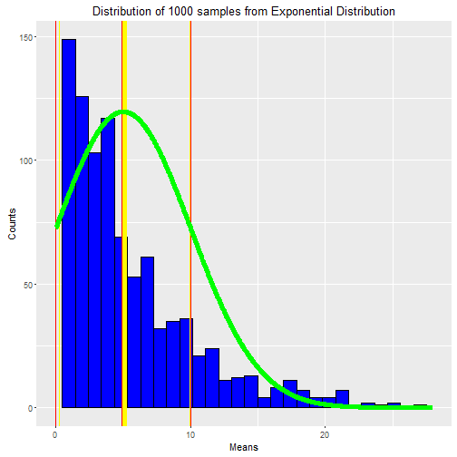
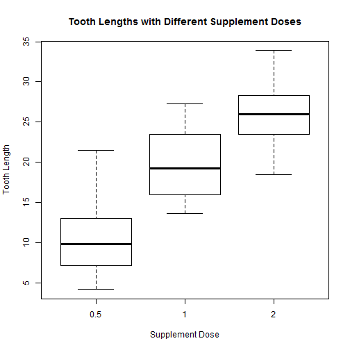

# Statistical_Inference_Week4_Programming_Assignment


## Overview

This report addresses the questions from [Week 4 Assignment](https://www.coursera.org/learn/statistical-inference/peer/3k8j5/statistical-inference-course-project) of __Statistical Inference__, the Course #6 of the Data Science Specialization series, offered by [Coursera.org](https://www.coursera.org/). The report is mainly consist of 2 parts, aiming to discuss the results of the two topics:

* Testing CLT with simulation from exponential distribution;

* Performing inferential analysis on the ToothGrowth dataset.


## Case Study 1: Simulation of CLT Based on Exponential Equation

In this project we will investigate the exponential distribution in R and compare it with the Central Limit Theorem (CLT). The exponential distribution can be simulated in R with `rexp(n, lambda)` where `lambda` is the rate parameter. The mean of exponential distribution is `1/lambda` and the standard deviation is also `1/lambda`. Set `lambda = 0.2` for all of the simulations. We will investigate the distribution of averages of 40 exponentials. Note that we will do __1000__ simulations.

Illustrate via simulation and associated explanatory text the properties of the distribution of the mean of 40 exponentials.


```r
n <- 40                 # Sample Size
times <- 1000           # Repeat Time
lambda <- 0.2           # Rate Constant

# Use set.seed() for reproducible purpose.
set.seed(7)
means <- replicate(times, mean(rexp(n, lambda)))

# Prepare numeric sequence to plot normal curve.
LIM <- c(floor(min(means)), ceiling(max(means)))
x <- seq(floor(min(means)), ceiling(max(means)), length = 1000)
nd <- dnorm(x, mean = 1/lambda, sd = 1/(lambda*sqrt(n)))

# Make plot.
library(ggplot2)
ggplot(as.data.frame(means), aes(x = means)) +
        geom_histogram(bins = 30, col = 'black', fill = 'blue') +
        lims(x = LIM) +
        # Theoretical Mean
        geom_vline(xintercept = 1/lambda, col = 'red', lwd = 2) +
        # Sample Mean
        geom_vline(xintercept = mean(means), col = 'yellow', lwd = 2) +
        # Theoretical SD
        geom_vline(xintercept = 1/lambda + c(-1, 1) * 1/(lambda*sqrt(n)), col = 'red') +
        # Sample SD
        geom_vline(xintercept = mean(means) + c(-1, 1) * sd(means), col = 'yellow') +
        # Gaussian PDF
        geom_line(aes(x = x, y = nd*times/5), col = 'green', lwd = 2) +
        labs(x = 'Means', y = 'Counts',
             title = 'Distribution of 1000 40-Mean Samples from Exponential Distribution')
```

```
## Warning: Removed 1 rows containing missing values (geom_bar).
```



```r
svar <- round(var(means), 3)
tvar <- round(1/lambda^2/n, 3)
print(paste0('Theoretical variance: ', tvar))
```

```
## [1] "Theoretical variance: 0.625"
```

```r
print(paste0('Sample variance: ', svar))
```

```
## [1] "Sample variance: 0.579"
```

From the above plot we firstly see the __distribution of the sample means__ (blue); the top of which stands somewhere between 4 and 5. The above plot:

1. Shows the __sample mean__, `mean(means)` __(yellow)__  and compare it to the __theoretical mean__, `1/lambda` __(red)__ of the distribution.

2. Shows how variable the sample is and compare it to the theoretical variance of the distribution.

        + By variance: the variance of sample means is 0.579, and that of theoretical means is 0.625.
        + By standard deviation: the standard deviations in the plot are marked in orange (sample) and red (theoretical).

3. Shows that the distribution is approximately normal by overlaying the __gaussian PDF__ (`mean = 1/lambda, sd = 1/(lambda*sqrt(n))`, green curve) with the histogram.


Just to make a comparison, we then quickly plot another set of 1000 samples from distribution. _Note this time there's only 1 sample each, instead of mean of 40_. Let's take a look at it.

```r
times <- 1000           # Repeat Time
lambda <- 0.2           # Rate Constant

# Use set.seed() for reproducible purpose.
set.seed(7)
means2 <- replicate(times, rexp(1, lambda))

# Prepare numeric sequence to plot normal curve.
LIM2 <- c(floor(min(means2)), ceiling(max(means2)))
x2 <- seq(floor(min(means2)), ceiling(max(means2)), length = 1000)
nd2 <- dnorm(x2, mean = 1/lambda, sd = 1/lambda)

# Make plot.
library(ggplot2)
ggplot(as.data.frame(means2), aes(x = means2)) +
        geom_histogram(bins = 30, col = 'black', fill = 'blue') +
        lims(x = LIM2) +
        # Theoretical Mean
        geom_vline(xintercept = 1/lambda, col = 'red', lwd = 2) +
        # Sample Mean
        geom_vline(xintercept = mean(means2), col = 'yellow', lwd = 2) +
        # Theoretical SD
        geom_vline(xintercept = 1/lambda + c(-1, 1) * 1/(lambda), col = 'red') +
        # Sample SD
        geom_vline(xintercept = mean(means2) + c(-1, 1) * sd(means2), col = 'yellow') +
        # Gaussian PDF
        geom_line(aes(x = x2, y = nd2*times*1.5), col = 'green', lwd = 2) +
        labs(x = 'Means', y = 'Counts',
             title = 'Distribution of 1000 samples from Exponential Distribution')
```



```r
svar2 <- round(var(means2), 3)
tvar2 <- round(1/lambda^2, 3)
print(paste0('Theoretical variance: ', tvar2))
```

```
## [1] "Theoretical variance: 25"
```

```r
print(paste0('Sample variance: ', svar2))
```

```
## [1] "Sample variance: 23.425"
```

Now as we see in the above, the distribution is way much more like exponential, rather than normal, even if the variances are similar (25 of theoretical and 23.425 of sample). In comparison, the 40-mean distribution is very normal-like.


## Case Study 2: 

In this case we will take a look at the `ToothGrowth` dataset from `datasets` package.

First let's load and take a quick look at the dataset

```r
# Load dataset
library(datasets)
data(ToothGrowth)

# Look at the dataset
dim(ToothGrowth)
```

```
## [1] 60  3
```

```r
summary(ToothGrowth)
```

```
##       len        supp         dose      
##  Min.   : 4.20   OJ:30   Min.   :0.500  
##  1st Qu.:13.07   VC:30   1st Qu.:0.500  
##  Median :19.25           Median :1.000  
##  Mean   :18.81           Mean   :1.167  
##  3rd Qu.:25.27           3rd Qu.:2.000  
##  Max.   :33.90           Max.   :2.000
```

```r
str(ToothGrowth)
```

```
## 'data.frame':	60 obs. of  3 variables:
##  $ len : num  4.2 11.5 7.3 5.8 6.4 10 11.2 11.2 5.2 7 ...
##  $ supp: Factor w/ 2 levels "OJ","VC": 2 2 2 2 2 2 2 2 2 2 ...
##  $ dose: num  0.5 0.5 0.5 0.5 0.5 0.5 0.5 0.5 0.5 0.5 ...
```

```r
boxplot(ToothGrowth$len ~ ToothGrowth$supp, xlab = 'Supplement Type',
        ylab = 'Tooth Length',
        main = 'Tooth Lengths with Different Supplement Types')
```


```r
boxplot(ToothGrowth$len ~ ToothGrowth$dose, xlab = 'Supplement Dose',
        ylab = 'Tooth Length',
        main = 'Tooth Lengths with Different Supplement Doses')
```



So from the summary we know that the dataset has 3 variables: 

* len  - tooth length: numeric value indicating tooth growth;

* supp - supplement type: 2-component factor (`VC`, `OJ`), 30 entries each;

* dose - dose in mg/day: 3-component numeric factor (`0.5`, `1`, `2`), 20 entries each.

Now we need to perform inferential analysis over the topics:

1. Is vitamin supplement type related to tooth growth?

2. Is vitamin supplement dose related to tooth growth?

For question 1, we'll establish H0: there's no difference between the 2 groups of supplements. Then we'll use t-test to find out p-value, and compare to the cutoff alpha = 0.05 (two sides).

```r
# Is vitamin supplement type related to tooth growth?
ttest <- t.test(len ~ supp, data = ToothGrowth)
ttest
```

```
## 
## 	Welch Two Sample t-test
## 
## data:  len by supp
## t = 1.9153, df = 55.309, p-value = 0.06063
## alternative hypothesis: true difference in means is not equal to 0
## 95 percent confidence interval:
##  -0.1710156  7.5710156
## sample estimates:
## mean in group OJ mean in group VC 
##         20.66333         16.96333
```

As the p-value (0.0606345) is greater, and confidence interval (-0.17 ~ 7.57) passes 0, we therefore have to retain the H0: __difference in supplement types isn't relevant to tooth growth__.

And for question 2, we need to do the same thing, but one pair each time; hence there are 3 null hypotheses to be checked. We'll show the summary of only 1 here.

```r
# Is vitamin supplement dose related to tooth growth?
# Here we show comparison between 0.5 and 1.
dose1 <- ToothGrowth[ToothGrowth$dose == 0.5, 1]
dose2 <- ToothGrowth[ToothGrowth$dose == 1, 1]
ttest1 <- t.test(dose1, dose2)
ttest1
```

```
## 
## 	Welch Two Sample t-test
## 
## data:  dose1 and dose2
## t = -6.4766, df = 37.986, p-value = 1.268e-07
## alternative hypothesis: true difference in means is not equal to 0
## 95 percent confidence interval:
##  -11.983781  -6.276219
## sample estimates:
## mean of x mean of y 
##    10.605    19.735
```

```r
# p-values for the other pairs
dose3 <- ToothGrowth[ToothGrowth$dose == 2, 1]
ttest2 <- t.test(dose1, dose3)
ttest3 <- t.test(dose2, dose3)
```

As we see, the p-value between dose of 0.5 mg/d and 1 mg/d is 1.2683007 &times; 10<sup>-7</sup>, way smaller than 0.05; so do the comparisons between 0.5 mg/d and 2 mg/d (4.397525 &times; 10<sup>-14</sup>), and 1 mg/d and 2 mg/d (1.9064295 &times; 10<sup>-5</sup>). Hence we can safely reject the H0, and confirm that __the dose does have a relationship with tooth growth__.
