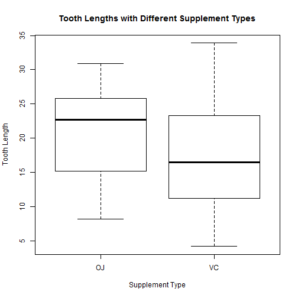

# Statistical Inference Week4 Programming Assignment (2)

## Overview

This report addresses the questions from [Week 4 Assignment](https://www.coursera.org/learn/statistical-inference/peer/3k8j5/statistical-inference-course-project) of __Statistical Inference__, the Course #6 of the Data Science Specialization series, offered by [Coursera.org](https://www.coursera.org/). The report is mainly consist of 2 parts, aiming to discuss the results of the two topics:

* Testing CLT with simulation from exponential distribution;

* __Performing inferential analysis on the ToothGrowth dataset__.


## Case Study 2: 

In this case we will take a look at the `ToothGrowth` dataset from `datasets` package.

First let's load and take a quick look at the dataset.


```
## [1] 60  3
```

```
##       len        supp         dose      
##  Min.   : 4.20   OJ:30   Min.   :0.500  
##  1st Qu.:13.07   VC:30   1st Qu.:0.500  
##  Median :19.25           Median :1.000  
##  Mean   :18.81           Mean   :1.167  
##  3rd Qu.:25.27           3rd Qu.:2.000  
##  Max.   :33.90           Max.   :2.000
```

```
## 'data.frame':	60 obs. of  3 variables:
##  $ len : num  4.2 11.5 7.3 5.8 6.4 10 11.2 11.2 5.2 7 ...
##  $ supp: Factor w/ 2 levels "OJ","VC": 2 2 2 2 2 2 2 2 2 2 ...
##  $ dose: num  0.5 0.5 0.5 0.5 0.5 0.5 0.5 0.5 0.5 0.5 ...
```




So from the summary we know that the dataset has 3 variables: 

* len  - tooth length: numeric value indicating tooth growth;

* supp - supplement type: 2-component factor (`VC`, `OJ`), 30 entries each;

* dose - dose in mg/day: 3-component numeric factor (`0.5`, `1`, `2`), 20 entries each.

Now we need to perform inferential analysis over the topics:

1. Is vitamin supplement type related to tooth growth?

2. Is vitamin supplement dose related to tooth growth?

For question 1, we'll establish H0: there's no difference between the 2 groups of supplements. Then we'll use t-test to find out p-value, and compare to the cutoff alpha = 0.05 (two sides).


```
## 
## 	Welch Two Sample t-test
## 
## data:  len by supp
## t = 1.9153, df = 55.309, p-value = 0.06063
## alternative hypothesis: true difference in means is not equal to 0
## 95 percent confidence interval:
##  -0.1710156  7.5710156
## sample estimates:
## mean in group OJ mean in group VC 
##         20.66333         16.96333
```

As the p-value (0.0606345) is greater, and confidence interval (-0.17 ~ 7.57) passes 0, we therefore have to retain the H0: __difference in supplement types isn't relevant to tooth growth__.

And for question 2, we need to do the same thing, but one pair each time; hence there are 3 null hypotheses to be checked. We'll show the summary of only 1 here.


```
## 
## 	Welch Two Sample t-test
## 
## data:  dose1 and dose2
## t = -6.4766, df = 37.986, p-value = 1.268e-07
## alternative hypothesis: true difference in means is not equal to 0
## 95 percent confidence interval:
##  -11.983781  -6.276219
## sample estimates:
## mean of x mean of y 
##    10.605    19.735
```

As we see, the p-value between dose of 0.5 mg/d and 1 mg/d is 1.2683007 &times; 10<sup>-7</sup>, way smaller than 0.05; so do the comparisons between 0.5 mg/d and 2 mg/d (4.397525 &times; 10<sup>-14</sup>), and 1 mg/d and 2 mg/d (1.9064295 &times; 10<sup>-5</sup>). Hence we can safely reject the H0, and confirm that __the dose does have a relationship with tooth growth__.


## Appendix: Codes

### Codes for Data Loading, Summary and Plotting


```r
# Load dataset
library(datasets)
data(ToothGrowth)

# Look at the dataset
dim(ToothGrowth)
summary(ToothGrowth)
str(ToothGrowth)
boxplot(ToothGrowth$len ~ ToothGrowth$supp, xlab = 'Supplement Type',
        ylab = 'Tooth Length',
        main = 'Tooth Lengths with Different Supplement Types')
boxplot(ToothGrowth$len ~ ToothGrowth$dose, xlab = 'Supplement Dose',
        ylab = 'Tooth Length',
        main = 'Tooth Lengths with Different Supplement Doses')
```

### Codes for T-Test of Supplement Types


```r
# Is vitamin supplement type related to tooth growth?
ttest <- t.test(len ~ supp, data = ToothGrowth)
ttest
```

### Codes for T-Tests of Supplement Doses


```r
# Is vitamin supplement dose related to tooth growth?
# Here we show comparison between 0.5 and 1.
dose1 <- ToothGrowth[ToothGrowth$dose == 0.5, 1]
dose2 <- ToothGrowth[ToothGrowth$dose == 1, 1]
ttest1 <- t.test(dose1, dose2)
ttest1

# p-values for the other pairs
dose3 <- ToothGrowth[ToothGrowth$dose == 2, 1]
ttest2 <- t.test(dose1, dose3)
ttest3 <- t.test(dose2, dose3)
```
